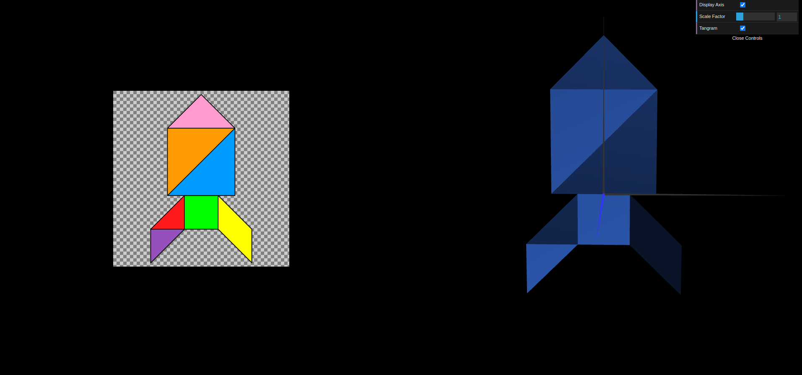
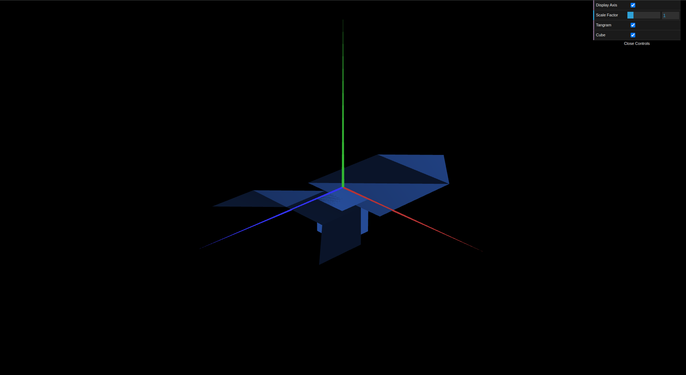
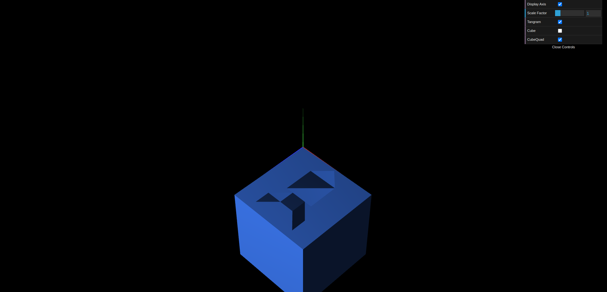

# CG 2024/2025

## Group T13G08

## TP 2 Notes

In this TP, we learned how to apply transformations to objects in a scene, including translation, rotation, and scaling.

- Initially, we struggled to grasp the order of transformations. We learned that transformations are applied in reverse order compared to their sequence in the code, which significantly affects the final positioning of objects. The first exercise was the most challenging, as it required applying multiple transformations. Positioning the parallelogram was particularly difficult, as it involved a translation and two rotations around different axes.

- In the second exercise, we explored scaling and its impact on objects. We also observed how transformed objects interact with each other within the scene, reinforcing our understanding of scaling’s role in scene composition.

- The third exercise focused on rotations, allowing us to experiment with rotational transformations and their effects on objects. This further solidified our understanding of transformation techniques and their practical applications in scene manipulation.

*Figure 1: TP2-1*

*Figure 2: TP2-2*

*Figure 3: TP2-3*
