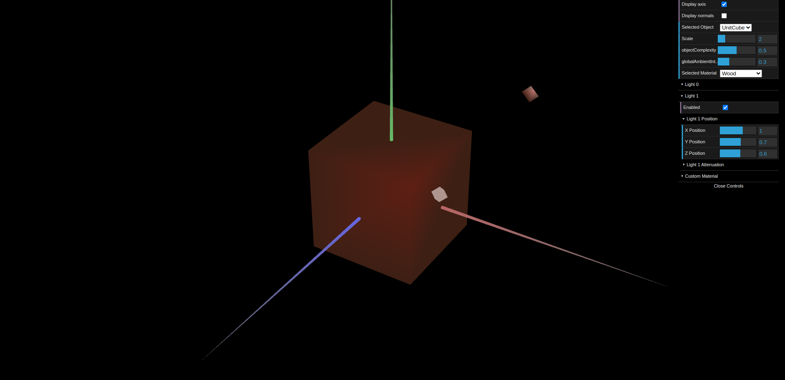
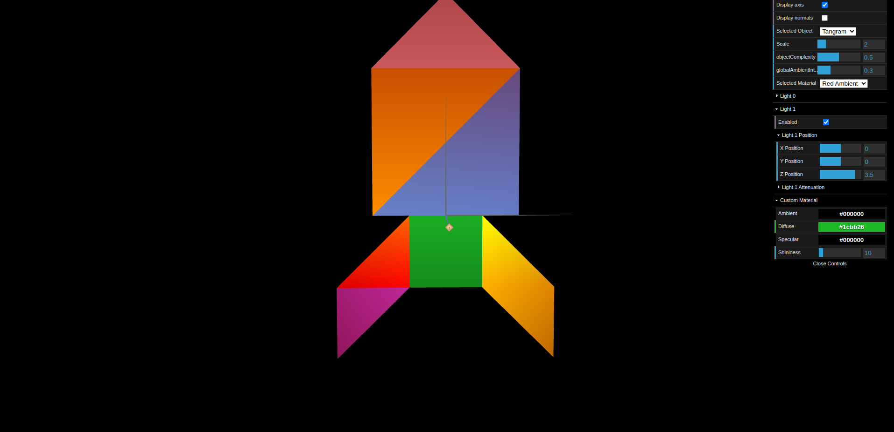
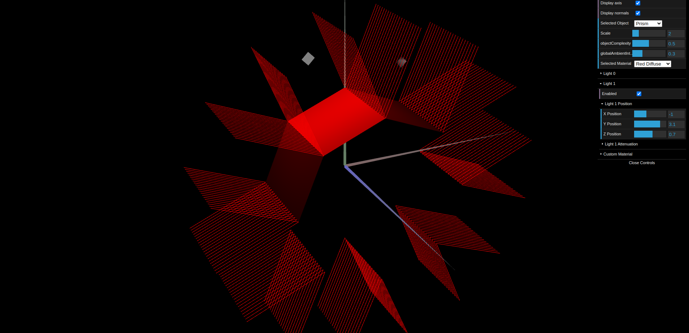
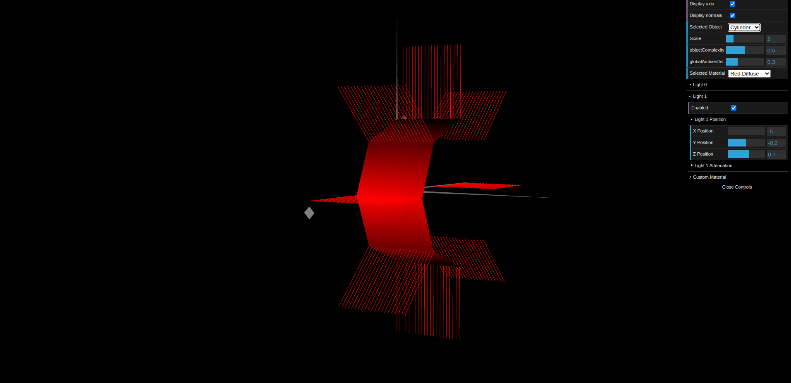

# CG 2024/2025

## Group T13G08

## TP 3 Notes

In this TP, the aim was to manipulate the components related to illumination, such as lights and normals.

- Through our initial experiments, we explored the available controls and observed how light and materials behaved depending on the components used.

- In the first exercise, we initially struggled to understand the purpose and application of normals. However, after analyzing the example of a cube—where each vertex is shared by three different faces, each requiring a distinct normal—we quickly grasped their significance. When designing materials, such as the wood-like texture and the materials for each tangram piece, we encountered no significant difficulties.

- In the second exercise, the requirement for a variable number of slices and stacks meant we had to carefully plan the construction of the prism. However, with the help of Figure 2, we quickly realized that for each face, the four associated vertices would share the same normal. This normal corresponds to the direction at the midpoint of the angle between two consecutive vertices. Regarding the stacks, since each face maintains a consistent height regardless of their number, we divided 1 by the total number of stacks and incremented progressively to build the entire face layer by layer.

- In Exercise 3, the logic remained similar; however, with the application of Gouraud shading, each vertex's normal was determined by its own position. Unlike the previous exercise, where all vertices of a face shared the same normal, this time each vertex had a unique normal based on its (X,Y) coordinates. This approach created a smoothing effect along the edges, giving the cylinder’s surface the appearance of a continuous curve.

*Figure 1: TP3-1*

*Figure 2: TP3-2*

*Figure 3: TP3-3*

*Figure 4: TP3-4*
