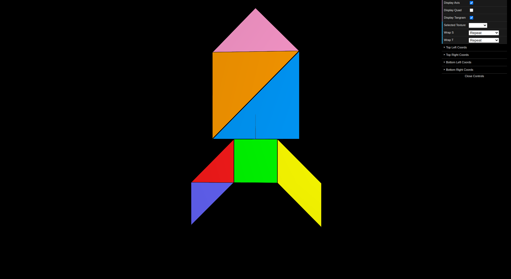
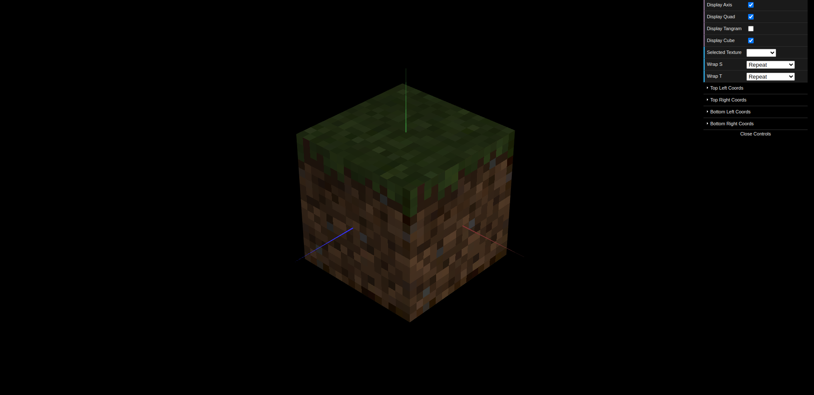

# CG 2024/2025

## Group T13G08

## TP 4 Notes

In this TP, the aim was to define the coordinates of a texture and combine it with the use of materials to obtain realistic appearances.

- Through our initial experiments, we explored the different ways of applying texture, where we mainly had initial difficulties understanding the ‘Clamp to Edge’ wrap mode, but after a few tests it became clear.

- In the first exercise, we were asked to apply a texture to each of the Tangram pieces using a given image. We had to load the texture correctly and pay close attention to the texture coordinates for each piece. The only piece that presented some difficulty was the parallelogram, as its orientation in the image was reversed compared to the initial position we had defined in the Tangram.

- In the second exercise, the objective was well understood and there were no major difficulties. However, at first, when we rendered the cube, all of its faces appeared with blue tones. These tones were later corrected by the expected colors when we displayed the Quad.

*Figure 1: TP4-1*

*Figure 2: TP4-2*
