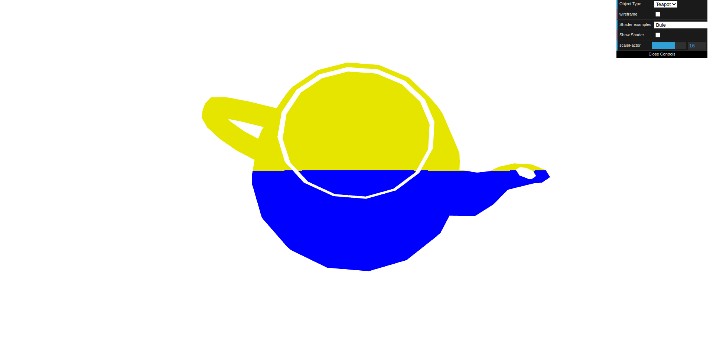
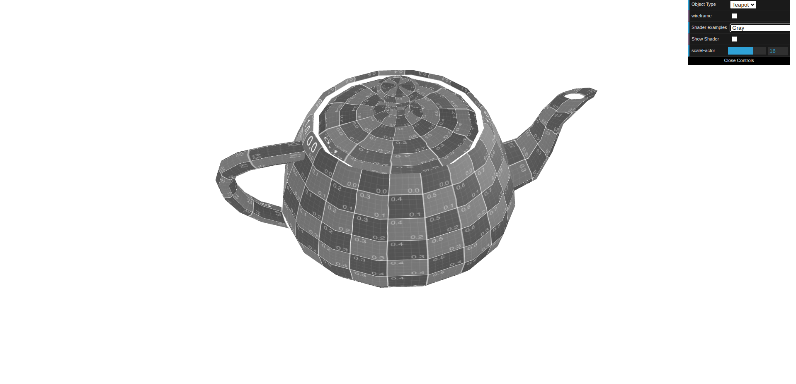
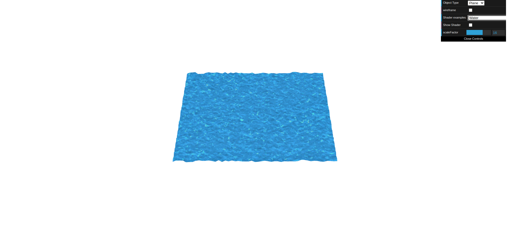

# CG 2024/2025

## Group T13G08

## TP 5 Notes

In this TP, the goal was to explore and manipulate fundamental concepts of shaders.

- In our initial experiments, we explored various types of shaders by applying them to a teapot and observing how each shader affected the object's appearance and behavior.

- In the first exercise, we created new vertex and fragment shaders that colored the upper part of the teapot (y ≥ 0.5) in yellow and the lower part in blue.

- In the second part of the first exercise, the objective was to create a horizontal movement along the X axis, following a sinusoidal wave. Afterwards, we applied a gray tone to the teapot, based on the existing sepia shader.

- In the second and final exercise, we simulated the movement of water by applying a water texture and shaders to a plane. The texture coordinates varied over time, and the vertex positions were adjusted based on the color values of the texture to create the illusion of surface relief.

Our main difficulties in this TP were primarily understanding how to work with the vertex and fragment shaders and how to use them together — particularly when it came to passing values between them and coordinating their behavior.

*Figure 1: TP5-1*

*Figure 2: TP5-2*

*Figure 3: TP5-3*
